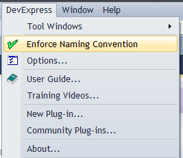

'Enforce Naming Conventions' for CodeRush
===
This plugin is an example of how to apply a naming convention across your solution.

The specific naming convention will perform 3 operations:

 * Remove any underscore prefixing.
 * Change non-public fields to have a lowercase first letter.
 * Change other members to have an uppercase first letter.

Usage 
======

Simply pick the 'Enforce Naming Convention' option from the DevExpress menu.

**Note:** You may also [bind a key](http://community.devexpress.com/blogs/rorybecker/archive/2010/10/05/binding-keys-in-coderush.aspx) to the '**Enforce Naming Convention**' command, and invoke the action this way.

The plugin will then iterate through your solution, adjusting the name of every member of every type in accordance with the stated naming convention.

All references to these members will of course be altered as well.

Once all renames are complete, summary details of operations performed are displayed in the status bar.

Alternatively, if no alterations were required, then this is also noted.

